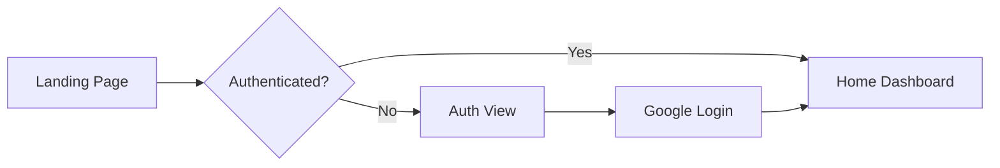
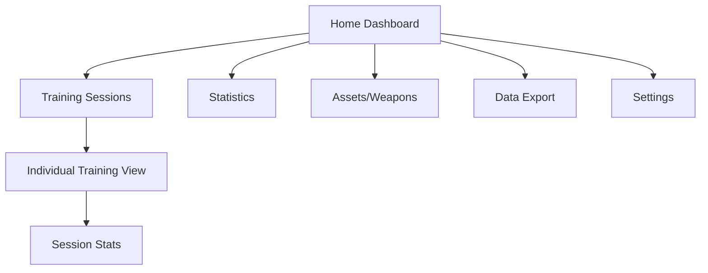

# Sniper Dashboard - Design Documentation

## Table of Contents
1. [App Overview](#app-overview)
2. [User Flow](#user-flow)
3. [Design System](#design-system)
   - [Color Palette](#color-palette)
   - [Typography](#typography)
   - [Components](#components)
   - [Spacing & Layout](#spacing--layout)
4. [Theme Support](#theme-support)
5. [Visual Examples](#visual-examples)

---

## App Overview

The Sniper Dashboard is a performance analytics application designed for tracking shooting performance, weapon statistics, and squad analytics. The app provides comprehensive data visualization and tracking capabilities for individual and team performance metrics.

### Key Features
- **Authentication**: Secure user authentication with Google OAuth integration
- **Dashboard**: Overview of performance metrics and quick stats
- **Training Sessions**: Track and analyze individual training sessions
- **Weapon Analytics**: Detailed weapon performance comparison
- **Squad Performance**: Team-based performance tracking
- **Data Export**: Export capabilities for detailed analysis
- **File Vault**: Secure storage for training-related files

---

## User Flow

### 1. Authentication Flow


### 2. Main Navigation Flow


### Page Structure
- **Auth View** (`/auth`) - Login/Registration page
- **Home** (`/`) - Main dashboard with navigation
- **Training** (`/training`) - Active training session tracking
- **Trainings** (`/trainings`) - Historical training sessions list
- **Stats** (`/stats`) - Performance statistics and charts
- **Assets** (`/assets`) - Weapon and equipment management
- **Settings** (`/settings`) - User preferences and configuration
- **Data Export** (`/export`) - Export functionality
- **File Vault** (`/vault`) - File storage and management

---

## Design System

### Color Palette

The application uses a sophisticated color system based on OKLCH color space for better perceptual uniformity and wide gamut support.

#### Primary Colors

**Brand Colors**
- **Primary**: `oklch(0.74 0.16 34.57)` - A vibrant orange used for primary actions and brand elements
- **Primary (Tailwind)**: `#161616` - Dark charcoal for high-contrast elements
- **Accent**: `oklch(0.83 0.11 57.89)` - A bright yellow-orange for highlights and accents

**Semantic Colors**
- **Success (Green)**
  - Primary: `#27BF4F` (green-500)
  - Light: `#EAFBEE` (green-50)
  - Dark: `#1E943D` (green-600)

- **Warning (Yellow)**
  - Primary: `#FFB800` (yellow-500)
  - Light: `#FFFBF0` (yellow-50)
  - Dark: `#CC7700` (yellow-600)

- **Error (Red)**
  - Primary: `#FF3333` (red-500)
  - Light: `#FFF0F0` (red-50)
  - Dark: `#CC0000` (red-600)
  - Destructive: `oklch(0.61 0.21 22.21)`

- **Info (Blue)**
  - Primary: `#005EFF` (blue-500)
  - Light: `#E5EFFF` (blue-50)
  - Dark: `#004BCC` (blue-600)

#### Neutral Colors

**Light Mode**
- Background: `oklch(0.99 0.01 67.74)` - Near white
- Foreground: `oklch(0.34 0.01 7.89)` - Dark text
- Card: `oklch(1 0 0)` - Pure white
- Border: `oklch(0.93 0.04 40.57)` - Light gray

**Dark Mode**
- Background: `oklch(0.26 0.02 351.79)` - Deep dark gray
- Foreground: `oklch(0.94 0.01 48.7)` - Light text
- Card: `oklch(0.32 0.02 339.89)` - Slightly lighter dark
- Border: `oklch(0.36 0.02 342.33)` - Subtle border

**Gray Scale**
```
grey900: #121212 (Darkest)
grey800: #2D2D2D
grey700: #424242
grey600: #585858
grey500: #7B7B7B
grey400: #B0B0B0
grey300: #D0D0D0
grey200: #E7E7E7
grey100: #EFEFEF
grey50:  #E7E7E7
grey25:  #F9F9F9
grey10:  #FCFCFC (Lightest)
```

#### Chart Colors
For data visualization, the app uses a consistent set of chart colors:
- Chart 1: `oklch(0.74 0.16 34.57)` - Primary orange
- Chart 2: `oklch(0.83 0.11 57.89)` - Accent yellow
- Chart 3: `oklch(0.88 0.08 56.41)` - Light yellow
- Chart 4: `oklch(0.82 0.11 41.27)` - Orange-yellow
- Chart 5: `oklch(0.64 0.13 32.06)` - Deep orange

### Typography

The application uses a carefully selected font stack for optimal readability:

**Font Families**
- **Sans-serif**: `Montserrat, sans-serif` - Primary font for UI elements
- **Serif**: `Merriweather, serif` - For editorial content
- **Monospace**: `Ubuntu Mono, monospace` - For code and data

**Text Styles**
- Headers: Bold weight, larger sizes
- Body: Regular weight, optimized for readability
- Data: Monospace for tables and statistics
- Interactive: Medium weight for buttons and links

### Components

#### UI Components Library
The app leverages multiple UI libraries for consistency:
- **Hero UI** (`@heroui/react`) - Modern React components
- **Material Tailwind** - Material Design components
- **Flowbite React** - Additional UI components
- **Custom Components** - Specialized visualizations

#### Key Component Patterns

**Cards**
- Clean white/dark backgrounds
- Subtle shadows using custom shadow variables
- Rounded corners (`border-radius: 0.625rem`)
- Clear content hierarchy

**Buttons**
- Primary: Orange background with white text
- Secondary: Light background with colored text
- Destructive: Red variants for dangerous actions
- Ghost: Transparent with hover effects

**Forms**
- Clean input fields with clear borders
- Focus states with ring effect
- Error states with red accents
- Helper text in muted colors

**Data Visualization**
- Consistent color palette across charts
- Dark mode support for all visualizations
- Interactive elements with hover states
- Responsive design for mobile devices

### Spacing & Layout

**Border Radius**
- Default: `0.625rem` (10px)
- Small elements: `0.375rem` (6px)
- Large elements: `0.75rem` (12px)

**Shadows**
The app uses a sophisticated shadow system with multiple levels:
```css
--shadow-2xs: Minimal elevation
--shadow-xs: Subtle elevation
--shadow-sm: Small elevation
--shadow: Default elevation
--shadow-md: Medium elevation
--shadow-lg: Large elevation
--shadow-xl: Extra large elevation
--shadow-2xl: Maximum elevation
```

**Grid System**
- 12-column grid for desktop
- 4-column grid for mobile
- Consistent gutters and margins
- Responsive breakpoints

---

## Theme Support

### Dynamic Theme Switching
The application supports both light and dark themes with:
- Automatic detection of system preferences
- Manual toggle option
- Persistent theme selection
- Smooth transitions between themes

### Theme Implementation
```typescript
// Theme Context Structure
type Theme = "dark" | "light";

// Automatic theme detection
- System preference detection
- LocalStorage persistence
- Real-time updates
```

### Color Adaptation
All colors are defined using CSS custom properties, allowing for:
- Instant theme switching
- Consistent color application
- Easy maintenance and updates
- Reduced CSS bundle size

---

## Visual Examples

### Color Usage Guidelines

**Primary Actions**
- Use primary orange (`oklch(0.74 0.16 34.57)`) for:
  - CTA buttons
  - Active navigation items
  - Important links
  - Progress indicators

**Feedback & Status**
- Green for success states
- Yellow for warnings
- Red for errors
- Blue for informational messages

**Content Hierarchy**
- Dark text on light backgrounds (Light mode)
- Light text on dark backgrounds (Dark mode)
- Muted colors for secondary content
- High contrast for important information

### Animation Patterns

**Blob Animation**
```css
animation: blob 7s infinite;
/* Creates organic movement for background elements */
```

**Float Animation**
```css
@keyframes float-slow {
  /* Gentle floating effect for decorative elements */
}
```

**Wave Loader**
- Custom loading animation
- Consistent with brand colors
- Smooth and non-intrusive

### Responsive Design

**Breakpoints**
- Mobile: < 640px
- Tablet: 640px - 1024px
- Desktop: > 1024px

**Adaptive Layouts**
- Stack navigation on mobile
- Side-by-side on desktop
- Collapsible sidebars
- Touch-friendly interfaces

---

## Best Practices

### Accessibility
- High contrast ratios (WCAG AA compliant)
- Clear focus indicators
- Semantic HTML structure
- ARIA labels where needed

### Performance
- Optimized color calculations using OKLCH
- CSS custom properties for efficient theming
- Lazy loading for heavy components
- Efficient shadow rendering

### Consistency
- Unified color system across all components
- Consistent spacing and sizing
- Predictable interaction patterns
- Clear visual hierarchy

### Future Considerations
- Extended color palette for new features
- Additional theme variations
- Enhanced animation library
- Component documentation system